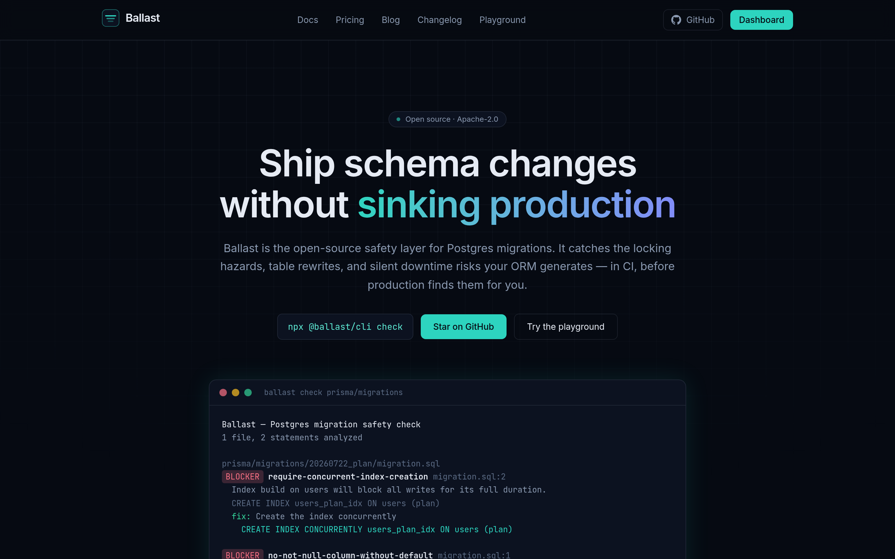
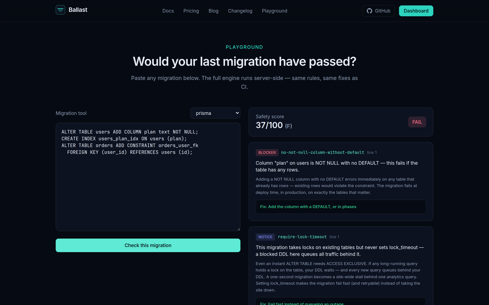

<p align="center">
  
</p>

<h1 align="center">Ballast</h1>

<p align="center">
  <strong>Ship schema changes without sinking production.</strong><br />
  The open-source safety layer for Postgres migrations — catch locking hazards,<br />
  table rewrites, and downtime risks in CI, before production finds them for you.
</p>

<p align="center">
  <a href="https://github.com/ballast-dev/ballast/actions/workflows/ci.yml"></a>
  <a href="LICENSE"></a>
  <a href="https://www.npmjs.com/package/@ballast/cli"></a>
  <a href="docs/roadmap.md"></a>
</p>

<p align="center">
  <a href="https://ballast.dev">Website</a> ·
  <a href="https://ballast.dev/playground">Playground</a> ·
  <a href="https://ballast.dev/docs">Docs</a> ·
  <a href="docs/architecture.md">Architecture</a> ·
  <a href="docs/roadmap.md">Roadmap</a> ·
  <a href="CONTRIBUTING.md">Contributing</a>
</p>

---

Your ORM writes correct DDL with zero commentary on lock behavior.
`CREATE INDEX` blocking every write to the table is not in the diff.
It works in staging because staging is small — and then it meets the
production table with 200 million rows and live traffic.

Ballast is a **deterministic static analyzer for migration SQL, wired into
CI**. It reads the migrations your existing tool already generates — no new
DSL, no new runner, no workflow change — and gates the PR when a change
would take dangerous locks, rewrite tables under load, or break the
still-running previous release.

```console
$ npx @ballast/cli check
Ballast — Postgres migration safety check
1 file, 2 statements analyzed

prisma/migrations/20260722_plan/migration.sql
[BLOCKER] no-not-null-column-without-default  migration.sql:1
  Column "plan" on users is NOT NULL with no DEFAULT — this fails if the table has any rows.
  fix: Add the column with a DEFAULT, or in phases

[BLOCKER] require-concurrent-index-creation  migration.sql:2
  Index build on users will block all writes for its full duration.
  fix: CREATE INDEX CONCURRENTLY users_plan_idx ON users (plan)

Safety score  █████░░░░░  47/100 (D)  —  2 blockers, 1 notice
FAIL — findings at or above the fail threshold
```

<p align="center">
  
</p>

<p align="center">
  
</p>

## Why Ballast is different

- **It models your migration runner, not just SQL.** `CREATE INDEX
  CONCURRENTLY` fails inside a transaction block. Whether your migration
  runs in one depends on your tool — Django and Rails wrap by default,
  Prisma and golang-migrate don't. Same SQL, different verdict; Ballast
  gets it right per preset.
- **False positives are treated as bugs.** Tables created in the same
  migration are tracked and exempted from locking rules — your init
  migration won't scream forty warnings. This is the difference between a
  linter people keep and a linter people uninstall.
- **Every finding teaches.** The message says what breaks, the *why*
  explains the mechanism (lock levels, rewrites, queue behavior), and the
  fix ships the safe rewrite with SQL.
- **Unsupported syntax degrades safely.** Rules run on a real SQL AST with
  a normalized-text fallback — what the parser can't model is still
  checked, never silently passed.
- **The engine is Apache-2.0, forever.** One runtime dependency, no
  network calls, no telemetry. Safety tooling you can't audit is a
  contradiction.

## Quickstart

```bash
# check now — auto-detects prisma/migrations, db/migrate, drizzle/, …
npx @ballast/cli check

# write a config with a detected preset
npx @ballast/cli init

# gate CI (GitHub Actions)
```

```yaml
# .github/workflows/ballast.yml
name: Migration safety
on:
  pull_request:
    paths: ["**/migrations/**", "**/*.sql"]
jobs:
  ballast:
    runs-on: ubuntu-latest
    steps:
      - uses: actions/checkout@v4
      - uses: ballast-dev/ballast/action@v0.4.0
```

Findings appear as inline annotations on the exact line of the migration in
the PR diff. Full setup, per-tool notes (Django's `sqlmigrate` piping,
Rails, Flyway), and config reference: **[ballast.dev/docs](https://ballast.dev/docs)**.

## The rules

18 rules, each encoding a production incident, across five categories —
**locking** (concurrent index builds, FK/CHECK validation, unique
constraints), **rewrites** (type changes, volatile defaults), **destructive
operations** (drops, TRUNCATE, unbounded DML), **rolling-deploy
compatibility** (renames, column drops), and **operational hygiene**
(lock_timeout, CONCURRENTLY-in-transaction, enum pitfalls).

The complete reference with mechanisms and safe alternatives renders live
from the engine's registry: **[ballast.dev/docs/rules](https://ballast.dev/docs/rules)**,
or `npx @ballast/cli rules` in your terminal.

Suppressions are inline and auditable:

```sql
-- ballast-ignore: no-drop-table
-- Decommissioned 2026-07, see RFC-114
DROP TABLE legacy_events;
```

## Repository layout

| Path | What it is |
| --- | --- |
| [`packages/core`](packages/core) | The engine: splitter → parser → 18 rules → scored report. Apache-2.0, 1 dependency. |
| [`packages/cli`](packages/cli) | `ballast` CLI: discovery, presets, pretty/JSON/GitHub output, `--upload`. |
| [`packages/db`](packages/db) | Prisma schema + client + queue contracts shared by web and worker. |
| [`apps/web`](apps/web) | ballast.dev: marketing site, docs, playground, dashboard, REST + GraphQL APIs. |
| [`apps/worker`](apps/worker) | pg-boss workers: check ingestion, GitHub annotations, rehearsals, retention. |
| [`action/`](action) | The GitHub Action. |
| [`examples/`](examples) | Unsafe/safe migration pairs — executable documentation, enforced by CI. |
| [`docs/`](docs) | [Architecture](docs/architecture.md) · [API](docs/api.md) · [Benchmarks](docs/benchmarks.md) · [Roadmap](docs/roadmap.md) |

## Ballast Cloud & self-hosting

The cloud (check history, org policy, PR annotations via GitHub App, and
**rehearsals** — your migration executed against a production-shaped
database with per-statement timings) lives in this same repository and
self-hosts from one compose file:

```bash
cp .env.example .env
docker compose up --build
```

Hosted: **[ballast.dev](https://ballast.dev)** — free for one project,
$99/mo flat for your whole org. The CLI and engine never require an account.

## Development

```bash
npm install
npm run build:packages   # engine + CLI (no database needed)
npm run test             # vitest: 84 tests across core, cli, web
npm run bench            # engine benchmarks (docs/benchmarks.md)
```

## Contributing

The contribution we want most is **rules born from real incidents** — there's
an [issue template](https://github.com/ballast-dev/ballast/issues/new?template=rule_proposal.yml)
that walks through the mechanism, the safe alternative, and the
false-positive analysis. See [CONTRIBUTING.md](CONTRIBUTING.md) for setup
and the two-path rule pattern.

Prior art we respect: [squawk](https://github.com/sbdchd/squawk),
[strong_migrations](https://github.com/ankane/strong_migrations),
[Atlas](https://atlasgo.io), [pgroll](https://github.com/xataio/pgroll).
Comparison in [docs/company/phase-1-problem.md](docs/company/phase-1-problem.md).

## License

[Apache-2.0](LICENSE) © Ballast Technologies, Inc.
