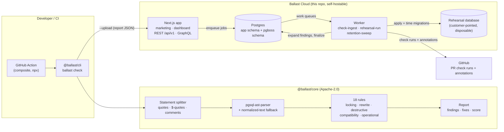
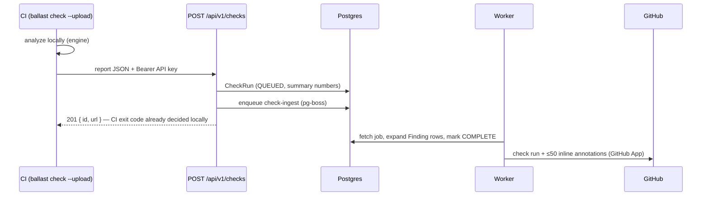

# Architecture

Ballast is a monorepo with two open-source packages, one shared data layer,
and two deployable apps. The engine has **one** runtime dependency and no I/O;
everything network- or state-touching lives at the edges.

## System overview



## Check ingestion sequence



Design point: the CLI's exit code **never** depends on the cloud. Analysis is
local; upload is telemetry for the team, not a gate dependency.

## Package layout

```
packages/core    engine: split → parse → rules → report     (dep: pgsql-ast-parser)
packages/cli     ballast bin: discovery, config, formatters (deps: core, commander, picocolors)
packages/db      Prisma schema + client + queue contracts   (dep: @prisma/client)
apps/web         Next.js 15: marketing, dashboard, APIs     (Clerk, Stripe, graphql-yoga)
apps/worker      pg-boss consumers                          (pg-boss, pg)
action/          composite GitHub Action (runs npx @ballast/cli)
```

## Engine design decisions

- **Two-path rules.** Every rule works from the AST when `pgsql-ast-parser`
  supports the statement and from normalized text when it doesn't (`NOT
  VALID`, `VALIDATE CONSTRAINT`, `VACUUM`, `LOCK TABLE`…). Unsupported syntax
  degrades to *still checked*, never *silently passed*.
- **Same-file table tracking.** `CREATE TABLE` earlier in the file exempts
  later DDL against that table — the single biggest false-positive class in
  migration linting.
- **Transaction modeling.** `stmt.inTransaction` reflects both explicit
  `BEGIN` and the preset's runner behavior (Prisma: no wrap; Django/Rails:
  wrap). Rules like `no-concurrent-index-in-transaction` are meaningless
  without this.
- **No I/O in core.** File reading, config discovery, and upload live in the
  CLI. The engine is a pure function `(files, config) → report`, which is why
  the playground can run it server-side per request.

## Cloud design decisions

- **pg-boss over Redis.** The job queue lives in the same Postgres in a
  `pgboss` schema. One less system to run for self-hosters; workers scale
  horizontally with pg-boss's locking.
- **Clerk only where needed.** Middleware matches `/dashboard` and billing
  routes; marketing, docs, playground, and the v1 API (Bearer keys) run with
  no Clerk configuration at all.
- **API keys**: `blt_live_` + 48 hex chars, stored as SHA-256, shown once,
  revocable; constant-time comparison on lookup.
- **Rehearsals are really executed** in a per-run schema on a
  customer-pointed disposable database, with `lock_timeout=30s` and
  `statement_timeout=15min` as guardrails, and the schema dropped after.
